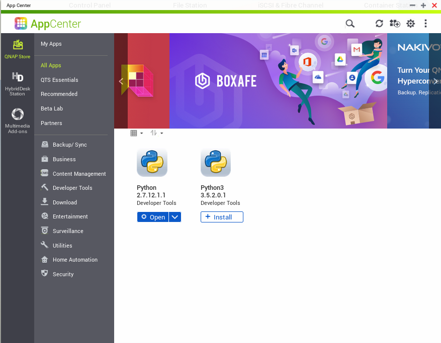

# Create Qnap Luns - Ansible Playbook

This is a quick and dirty appraoch to automating the creation of an iSCSI target and LUNS on a qnap NAS.

Prerequisites:

. Ansible
. Python installed on the NAS via the App Center (QPKG)

Ensure the host where ansible is running has ssh access to the QNAP NAS:

```
ssh-copy-id admin@MYNASHOSTNAME
```

Python in App Center:



## How does this work?

The playbook uses the `qcli*` utilities available on the QNAP NAS in order to perform the actions of creating a new iSCSI target and creating Luns.  

Also please note the `inventory` file has `ansible_python_interpreter=/usr/local/bin/python` - so that we point to the correct python location on the QNAP NAS.

## How do I run it?

Make sure the `inventory` and the `vars/sample-vars.yml` are configured as you wish, then run:

```
ansible-playbook -i inventory create-qnap-luns.yml
```

## Why?

I'm using this to automate the provisioning of external storage for Openshift clusters, but in the main WHY NOT?!

